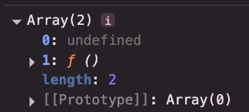
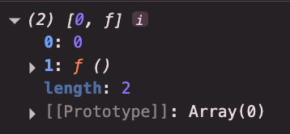

## React 입문


### JSX 주의사항
1. 중괄호 내부에는 자바스크립트 표현식만 넣을 수 있다.
2. 숫자, 문자열, 배열 값만 렌더링된다.
3. 모든 태그는 닫혀있어야 한다.
4. 최상위 태그는 반드시 하나여야만한다.(빈 태그로도 가능)

<br>
<hr>

### Props
부모 component가 자식 component들에게 마치 함수의 인수를 전달하듯이 원하는 값을 전달해 주는 것

<br>

**App.jsx**
```
function App() {

  const buttonProps = {
    text: "메일",
    color: "red",
    a: 1,
    b: 2,
    c: 3,
  };

  return (
    <>
      <Button {...buttonProps} />
      <Button text={"카페"}>
        <Header />
      </Button>
      <Button text={"블로그"}>
        <div>자식 요소</div>
      </Button>
    </>
  );
}
```

<br>

**Button.jsx**
```
const Button = ({children, text, color = "black"}) => {
    return (
        <button style={{ color: color }}>
            {text} - {color.toUpperCase()}
            {children}
        </button>
    );
};
```

<li>구조분해 할당을 이용해 default값을 설정할 수 있다.</li>
<li> HTML 코드도 props로 담을 수 있다. 그렇게 되면 자식 component에서는 <code>children</code>이라는 매개변수로 자동으로 전달된다.</li>
<li> 또한, 직접 만들었던 component도 props로 전달 가능하다. (ex. <code>&lt;Header /&gt;</code>)</li>

<br><br>

**결과**


<br>
<hr>

### Event Handling
이벤트가 발생했을 때 그것을 처리하는 것 (ex. 버튼 클릭 시 경고창 노출) <br><br>

#### 합성 이벤트(Synthetic Base Event)란?

React에서 사용하는 **합성 이벤트**는 브라우저마다 제각각인 이벤트 객체를 **하나의 통일된 형태**로 감싼 것  

현대 웹 환경에서는 다양한 브라우저가 존재하며, 각 브라우저마다 제공하는 **Event 객체의 구조와 동작 방식이 다르다.**  
React는 이를 통일하여 일관성 있는 이벤트 처리 방식을 제공한다.  
<br>

> **Cross Browsing Issue**  
> 브라우저마다 스펙이 달라 발생하는 호환성 문제를 의미 ▶️ 이 문제를 해결하는 것이 바로 React에서의 합성 이벤트!  
> **즉, 모든 브라우저에서 사용할 수 있는 통합된 규격의 이벤트 객체**  

<br>
<hr>

### State  
React에서 State는 component의 현재 상태를 보관하는 변수를 의미  
State의 값에 따라 렌더링되는 UI가 결정된다.  
변화하는 가변적인 값을 관리할 때, 그런 값을 렌더링해주고 싶다면 State를 이용해서 처리!  
<br>

#### Re-Render / Re-Rendering
component가 다시 렌더링되는 상황  
**<U>※ state값이 변경되면 해당 component는 다시 reRendering 되는 것</U>**

 

<li><b>첫 번째 요소(0)</b> : 새롭게 생긴 state의 값, 즉 초기값을 의미 <code>(const [count, setCount] = useState(0);)</code></li>
<li><b>두 번째 요소(1)</b> : state의 값을 변경하는 함수, <code><b>상태 변화 함수</b></code>라고 부름</li>
<br>

**자신이 갖는 state값이 변경되지 않아도 부모로부터 받은 props값이 바뀌게 되면 reRendering된다.**

<br>

#### ReRendering되는 경우 3가지
1. state값이 변경되었을 때
2. 자신이 제공받는 props의 값이 변경되었을 때
3. 부모 component가 reRendering될 때, 자식 component도 reRendering