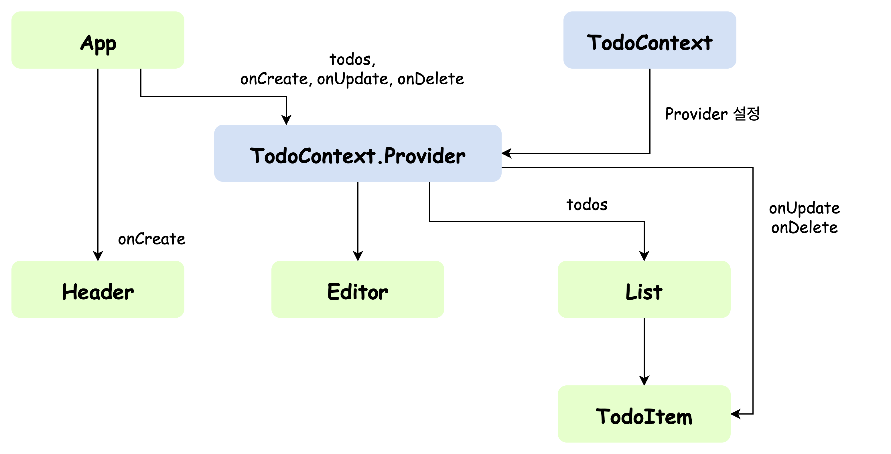

## React Context
Component간의 데이터를 전달하는 또 다른 방법  
기존의 Props가 가지고 있던 단점을 해결할 수 있음

 

**Props의 단점 ▶️ props drilling**  
Props는 부모 → 자식으로만 데이터를 전달할 수 있음!  
그렇게 때문에 자식 component가 줄줄이 있다면 직접적으로 전달하기 어려움  

> ex) App → B → C → D 이라고 할 때, App은 D component에게 데이터를 전달하기 위해서는 B와 C를 거쳐서 전달할 수 있다.  
이러한 문제가 props drilling이다.

 

### Context
데이터 보관소(객체)

 

**Context 적용 후, React App의 계층 구조**

