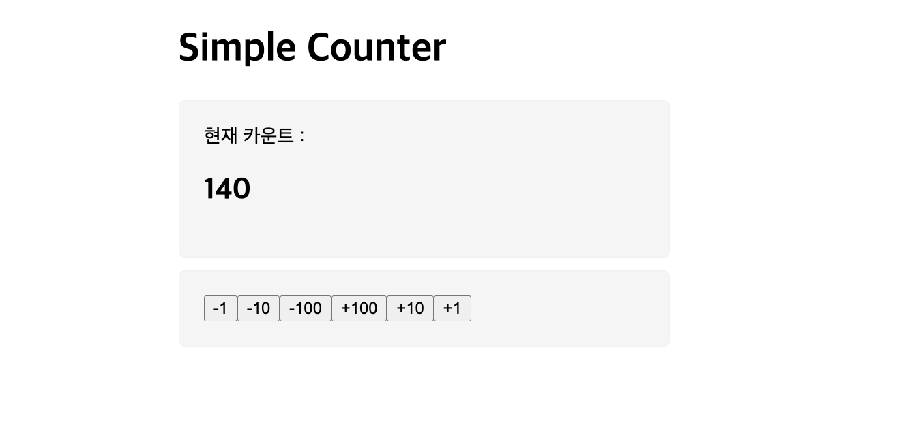
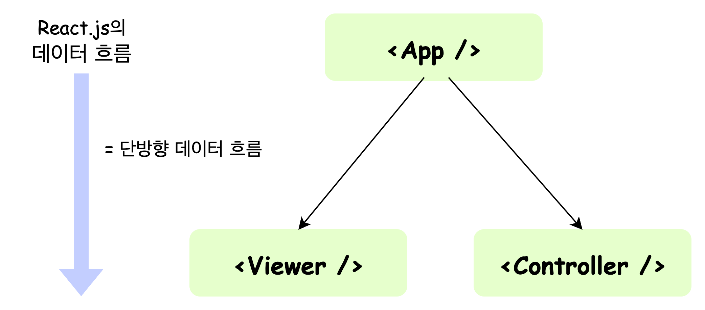

## Counter App
### 결과물

### State Lifting (State 끌어올리기)
이런 계층 구조상에서, 위로 올려서 그 아래의 component들이 모두 공유할 수 있도록 만드는 방법을 의미

React에서 화면을 구성할 때, 여러 개의 component들이 **부모-자식 관계**를 이루며 계층 관계를 이룬다.  

특정 component가 다른 component에게 data를 전달하려면, <U><b>반드시 두 component는 부모-자식 관계를 가져야한다.</b></U>  

React에서는 props라는 기능을 이용해 부모에서 자식 방향으로만 데이터를 전달할 수 있다.  
그렇기 때문에 데이터는 위에서 아래로 즉, 한 가지 방향으로 흐르게 된다.(= 단방향 데이터 흐름)  

그렇기 때문에, 하나의 state를 여러 component에서 관리하게 될 경우 <U><b>state는 여러 component들의 공통 부모가 되는 곳에 만들어야 한다.</b></U>

  

**따라서, 우리는 데이터의 원천인 state를 어떤 component에 위치시킬 것인지 항상 잘 고민하고 고려해서 결정해야 한다‼️**