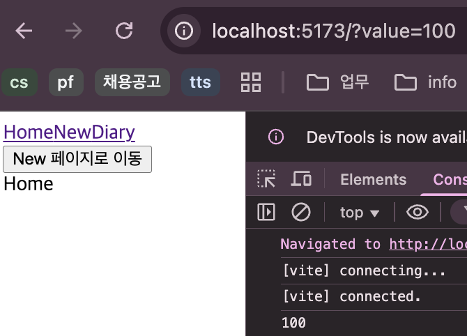

## 감정 일기장 App

1. `/` : 모든 일기를 조회하는 Home 페이지
2. `/new` : 새로운 일기를 작성하는 New 페이지
3. `/diary` : 일기를 상세히 조회하는 Diary 페이지

<br>


### Router
- ```<Routes>``` component 안에는 ```<Route>```만 들어갈 수 있다.  
 ```<div>```와 같이 다른 내용들 x
- ```<Routes>``` component 밖에 위치한 component는 Route에 상관 없이 모두 렌더링이 된다.

#### Example
```
<>
    <div>Hello</div>
      <Routes>
        <Route path="/" element={<Home />} />
        <Route path="/new" element={<New />} />
        <Route path="/diary" element={<Diary />} />
        <Route path="*" element={<NotFound />} />
      </Routes>
</>
```
위 코드에서 ```<div>Hello</div>```는 모든 페이지에 공통으로 렌더링이 되는 것이다.  

<br>


### 동적 경로(Dynamic Segments)
- **URL Parameter**  
```/``` 뒤에 아이템의 id를 명시 (~/product/**1**)  
아이템의 id 등의 변경되지 않는 값을 주소로 명시하기 위해 사용됨  

- **Query String**  
```?``` 뒤에 변수명과 값 명시 (~/search?**q=검색어**)  
검색어 등의 자주 변경되는 값을 주소로 명시하기 위해 사용됨  
```
import { useSearchParams } from "react-router-dom";

const Home = () => {
    const [params, setParams] = useSearchParams();
    console.log(params.get("value"));
    
    return <div>Home</div>;
};

export default Home;
```


<br>

#### Link VS useNavigate
link가 필요할 때는 Link Component를 사용  
event handler안에서 특정 조건에 따라 페이지를 이동시켜야한다면 useNavigate 사용


### Web Storage
웹 브라우저 내장 DB
<br>

#### SessionStorage
- 브라우저 탭 별로 데이터를 보관
- 탭이 종료되기 전에는 데이터 유지(새로고침)
- 탭이 종료되거나 꺼지면 데이터 삭제


#### LocalStorage
- 사이트 주소별로 데이터 보관
- 사용자가 직접 삭제하기 전까지 데이터 보관