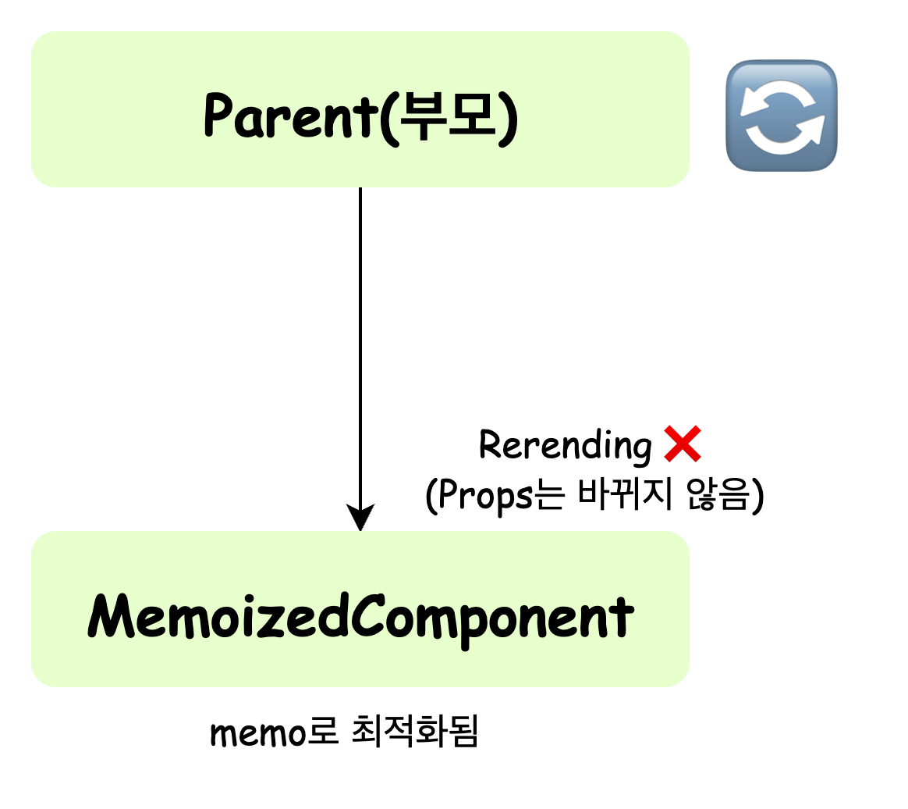
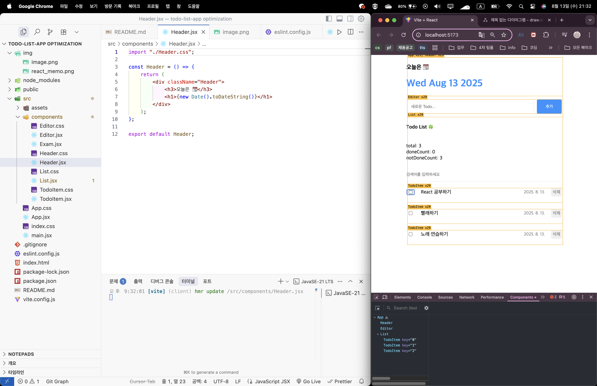
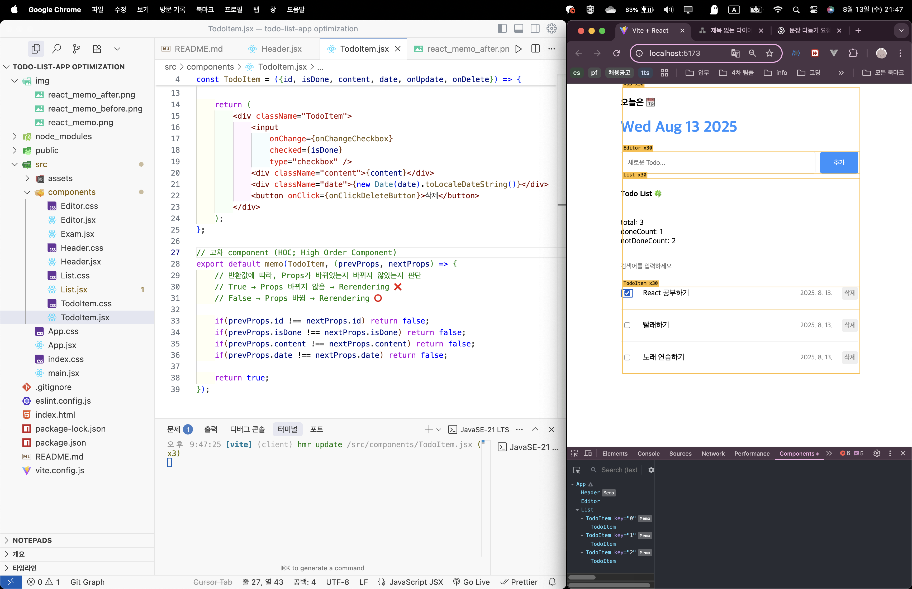

# React App 내부의 최적화 방법
- component 내부의 불필요한 연산 방지
- component 내부의 불필요한 함수 재생성 방지
- component의 불필요한 Rerendering 방지

<br>

### useMemo
**`메모이제이션`** 기법을 기반으로 불필요한 연산을 최적화하는 React Hook (자매품: `useCallback`)

<br>

### React.memo
React의 내장 함수  
Component를 인수로 받아, 최적화된 component로 만들어 반환
component의 props를 얕게 비교하여 props가 바뀌지 않았으면 Rerendering을 건너뛰게 해 component rendering 최적화에 주로 사용
```
const MemoizedComponent = memo(Component)
```
반환값으로 최적화된 component는 Props를 기준으로 메모이제이션 된다.


##### 예시

`react_memo`를 사용하기 전에는, 오른쪽 화면 상단의 Header(“오늘은📆 + 날짜”)가 App component의 자식으로 위치해 있기 때문에, 부모 component인 App이 Rerendering될 때 Header 역시 함께 Rerendering될 수밖에 없다.<br>
 <u>이는 불필요한 Rerendering이다.</u>
 
 <br>


`react_memo`를 사용하게 되면, 동일한 조건에서 오른쪽 화면 상단에 Header Component가 더 이상 Rerendering되지 않는 것을 확인할 수 있다.<br>
그리고 한 가지 더, 현재 checkbox를 클릭하는 것은 "React 공부하기" 항목이지만, 아래에 있는 "빨래하기", "노래 연습하기" 항목도 마찬가지로 불필요하게 Rerendering 되고 있다. <br>
이러한 불필요한 Rerendering은 `HOC(High Order Component)` 또는 `useCallback`을 사용해 방지할 수 있다.

<br>

### useCallback
전달된 함수 자체를 메모이제이션하여 의존성 배열(deps)의 값이 바뀌지 않는 한 함수가 재생성되지 않도록 한다.


왼쪽의 코드를 추가해주니, "React 공부하기" 항목만 Rerendering 되고 있는 것을 볼 수 있다.

<br>

**useCallback 사용 예제**
```
const onCreate = useCallback((content) => {
    dispatch({
      type: "CREATE",
      data: {
        id: idRef.current++,
        isDone: false,
        content: content,
        date: new Date().getTime(),
      },
    });
  }, []);

const onUpdate = useCallback((targetId) => {
  dispatch({
    type: "UPDATE",
    targetId: targetId,
  });
}, []);

const onDelete = useCallback((targetId) => {
  dispatch({
    type: 'DELETE',
    targetId: targetId,
  });
}, []);
```