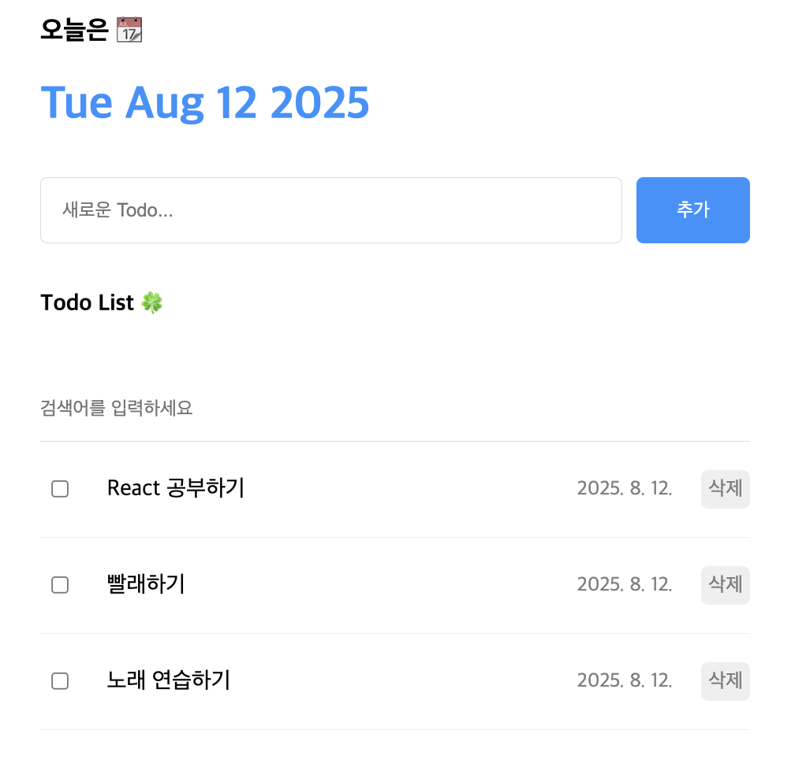

# Todo List Project


mock data를 이용해서 내용 초기 setting
```
const mockData = [
  {
    id: 0,
    isDone: false,
    content: "React 공부하기",
    date: new Date().getTime(),
  },
  {
    id: 1,
    isDone: false,
    content: "빨래하기",
    date: new Date().getTime(),
  },
  {
    id: 2,
    isDone: false,
    content: "노래 연습하기",
    date: new Date().getTime(),
  },
];

const [todos, setTodos] = useState(mockData);
```

배열일 때, State set하는 방법
```
 setTodos (
      todos.map((todo) =>
        todo.id === targetId
          ? {...todo, isDone: !todo.isDone }
          : todo)
    );
```

검색어 찾기 → 찾은 내용으로 reRendering
```
const getFilteredData = () => {
        if (search === "") {
            return todos;
        }
        return todos.filter((todo) =>
            todo.content
                .toLowerCase()
                .includes(search.toLowerCase()));
    };

const filteredTodos = getFilteredData();

return (
        <div className="List">
            <h4>Todo List 🍀</h4>
            <input
                value={search}
                onChange={onChangeSearch}
                placeholder="검색어를 입력하세요" />
            <div className="todos_wrapper">
                {filteredTodos.map((todo) => {
                    return <TodoItem key={todo.id} {...todo} onUpdate={onUpdate} onDelete={onDelete} />;
                })}
            </div>
        </div>
    );
```
<br>

#### Q. React에서 배열이나 객체 형태의 State를 업데이트할 때 기존 State를 직접 수정하지 않고 새로운 State를 만들어 사용하는 이유는?
> React는 **State 객체/배열의 '참조'가 변경될 때 리렌더링을 결정**한다.  
새 객체/배열을 만들면 참조가 달라져 React가 변경을 감지하고 UI를 업데이트한다.  

<br>

#### Q. App 컴포넌트에 있는 State 변경 함수(예: `setTodos`)를 자식 컴포넌트(예: Editor, TodoItem)에서 호출하려면 어떻게 해야 할까?
> React에서 부모 컴포넌트의 함수를 자식 컴포넌트가 실행하려면 **Props를 통해 해당 함수 자체를 자식에게 전달**해야 한다.  
자식은 전달받은 Props 함수를 호출합니다.

<br>

#### Q. 컴포넌트 렌더링과 상관없이 값이 유지되며, 값 변경이 리렌더링을 유발하지 않는 변수를 저장할 때 주로 사용하는 React Hook은 무엇인지?
> `useRef`는 값이 **컴포넌트 생명주기 동안 유지**되지만, **해당 값의 변경이 컴포넌트 리렌더링을 유발하지 않는 변수를 관리할 때 사용**된다.  
특정 DOM 요소 접근이나 변하지 않는 값을 저장할 때 유용합니다.